# WorkSphere — Project Management and Collaboration

A production-minded, multi-tenant workspace application for planning projects,
coordinating teams, and following delivery from one place. WorkSphere combines
Kanban task management, realtime conversations, workspace analytics, role-based
administration, notifications, billing controls, and immutable audit history in
a modular Next.js monolith.

## Screenshots / Demo

| Workspace overview                                                      | Project delivery                                                       |
| ----------------------------------------------------------------------- | ---------------------------------------------------------------------- |
| 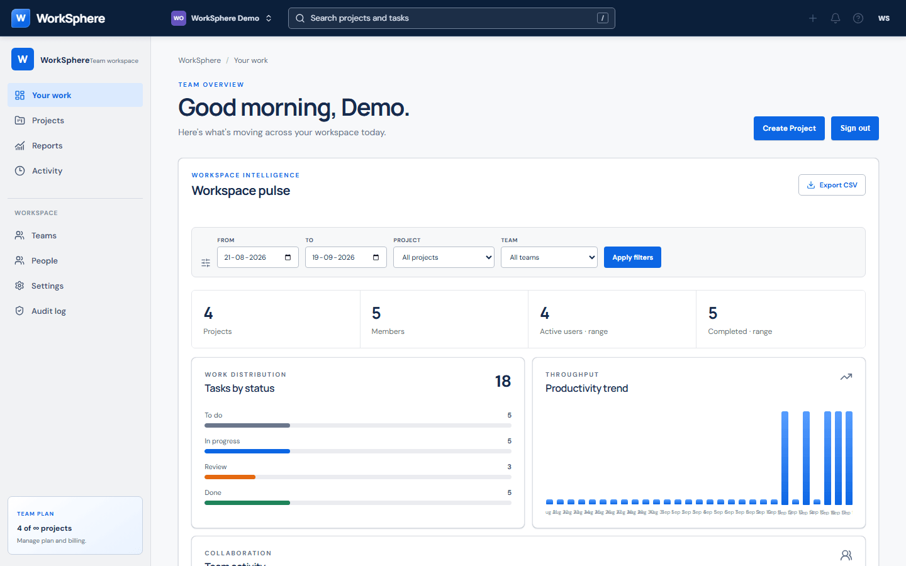 | 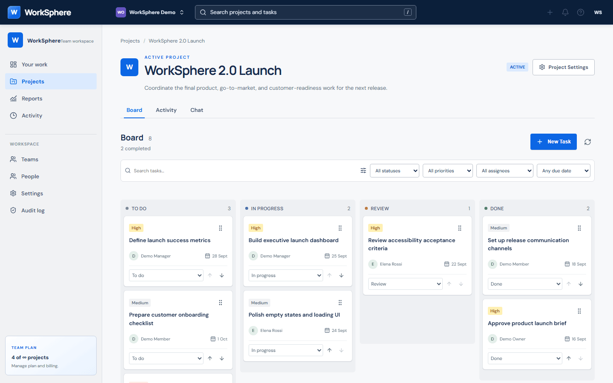 |

| People management                                                  | Billing and capacity                                               |
| ------------------------------------------------------------------ | ------------------------------------------------------------------ |
| 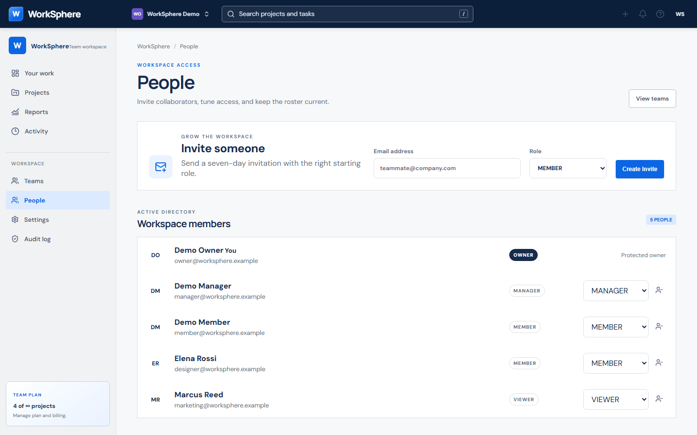 | 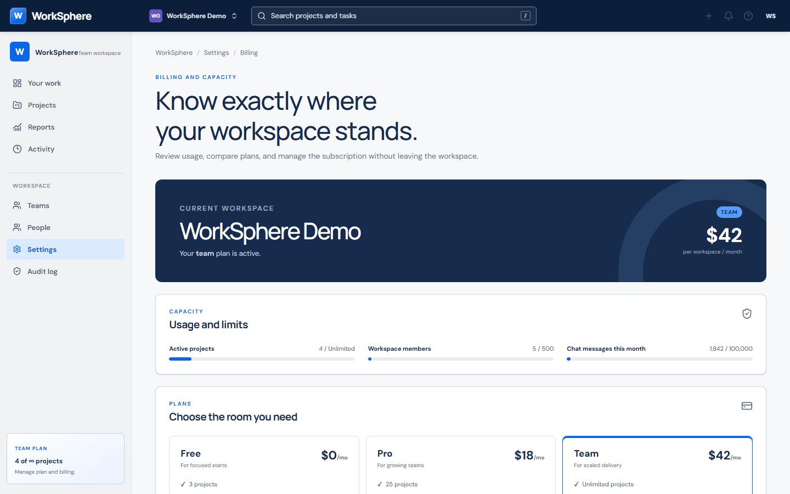 |

▶ **[Application walkthrough](#13-demo)** — registration → workspace pulse →
project delivery → collaboration → administration.

## Table of Contents

1. [Problem](#1-problem)
2. [Features](#2-features)
3. [Tech Stack](#3-tech-stack)
4. [Architecture](#4-architecture)
5. [Database Schema](#5-database-schema)
6. [API Documentation](#6-api-documentation)
7. [Authentication Strategy](#7-authentication-strategy)
8. [Security Considerations](#8-security-considerations)
9. [Testing Strategy](#9-testing-strategy)
10. [Performance Considerations](#10-performance-considerations)
11. [Deployment Architecture](#11-deployment-architecture)
12. [Screenshots](#12-screenshots)
13. [Demo](#13-demo)
14. [What I Learned](#14-what-i-learned)
15. [Future Improvements](#15-future-improvements)
16. [Trade-offs & Design Decisions](#16-trade-offs--design-decisions)
17. [Scaling Strategy](#17-scaling-strategy)

## 1. Problem

Project tools become difficult to trust when identity, authorization, delivery
state, and communication are implemented as unrelated CRUD screens. A useful
workspace has to answer harder questions:

- **Tenant isolation** — can every query and mutation prove which workspace owns
  the data?
- **Concurrent planning** — what happens when two people reorder the same board?
- **Permission clarity** — can owners, managers, members, and viewers do exactly
  what their roles allow?
- **Durable collaboration** — are chat, comments, notifications, and activity
  history connected to authoritative database state?
- **Operational visibility** — can a team understand workload, throughput,
  subscription capacity, and sensitive changes without exporting everything?

WorkSphere addresses these concerns while remaining a portfolio-sized modular
monolith that can be run locally with PostgreSQL and optional Redis.

## 2. Features

**Planning and delivery**

- Organization-scoped project directory with active and archived projects
- Responsive Kanban boards with pointer and keyboard movement
- Optimistic drag-and-drop with revision conflicts, rollback, and destination
  feedback
- Task priority, assignee, reporter, due date, status, position, and rich detail
- Project membership, team ownership, filtering, search, and CSV analytics export
- Task comments with editing, moderation, pagination, and `@mention` resolution

**Collaboration and visibility**

- Project and team conversations with persisted message history and read state
- Socket.IO updates for chat, typing, tasks, comments, and notifications
- Workspace and project activity timelines with cursor pagination
- Assignment, mention, status-change, invitation, and reminder notifications
- Per-user notification preferences and read/unread management
- Workspace analytics for status distribution, throughput, active contributors,
  and team activity

**Workspace administration**

- Multiple organizations per account with an active-workspace switcher
- OWNER, ADMIN, MANAGER, MEMBER, and VIEWER roles
- Team creation, membership management, invitations, and project access
- Account, workspace, project, billing, and notification settings
- Free, Pro, and Team plan entitlements with usage counters
- Append-only tenant audit log for security-sensitive changes
- Fully responsive application shell with accessible mobile navigation

## 3. Tech Stack

| Layer           | Choice                                 | Notes                                                                      |
| --------------- | -------------------------------------- | -------------------------------------------------------------------------- |
| Framework       | Next.js 16 App Router + React 19       | Server Components for data-heavy routes; client components for interaction |
| Language        | TypeScript 5, strict mode              | Typed services, schemas, routes, events, and UI contracts                  |
| Styling         | Hand-authored CSS                      | Responsive shell, locally hosted DM Sans and Manrope fonts                 |
| Database        | PostgreSQL 17                          | Local Docker service with durable volume                                   |
| ORM             | Prisma 7 + PostgreSQL adapter          | Transactions, scoped queries, generated client                             |
| Validation      | Zod 4                                  | Environment, route input, query, and realtime event validation             |
| Authentication  | Custom credentials + database sessions | `scrypt` password hashes and hashed session tokens                         |
| Authorization   | Tenant guards + role permission matrix | Service-layer authorization, not presentation-only checks                  |
| Cache / pub-sub | Redis 7, optional                      | Analytics caching, rate limits, and realtime publication                   |
| Realtime        | Socket.IO                              | Authenticated user/project/team rooms over WebSocket                       |
| Jobs            | BullMQ                                 | Email delivery queue and worker with local fallback behavior               |
| Drag and drop   | dnd-kit                                | Pointer and keyboard sensors with persisted ordering                       |
| Testing         | Node test runner + Playwright          | Unit, database integration, API smoke, and browser workflows               |

## 4. Architecture

WorkSphere is a modular monolith. Pages and route handlers stay thin; domain
services own authorization and transaction boundaries; repositories contain
explicitly scoped persistence queries.

```text
src/
├── app/                  Next.js pages, layouts, route handlers, and error UI
├── components/           Interactive product and settings components
├── modules/              Auth, organizations, teams, projects, tasks, chat,
│   ├── authorization/    notifications, analytics, billing, activity, audit
│   └── */*.service.ts    Business rules and transaction boundaries
├── database/             Prisma client factory and application singleton
├── cache/                Redis cache policies and graceful fallbacks
├── realtime/             Socket.IO gateway, room authorization, publisher
├── queue/                BullMQ connection and email queue
└── workers/              Background email processor
```

**Request flow — move a task across the board**

```text
Browser drag
  → PATCH /api/projects/:projectId/board
  → Zod validates task IDs, destination status, index, and board revision
  → service verifies organization membership + projects:manage permission
  → PostgreSQL transaction
      1. conditionally increments Project.boardRevision
      2. locks the move to the expected revision
      3. normalizes source and destination positions
      4. records activity and notifications
  → committed board is returned
  → best-effort Redis publication reaches authorized Socket.IO rooms
  → conflicting clients refresh from PostgreSQL, the source of truth
```

Realtime delivery is deliberately best-effort. A missed WebSocket event never
becomes data loss because REST reads and PostgreSQL remain authoritative.

## 5. Database Schema

Full schema: [`prisma/schema.prisma`](prisma/schema.prisma) — 24 models.
Migration and design notes: [`docs/database.md`](docs/database.md).

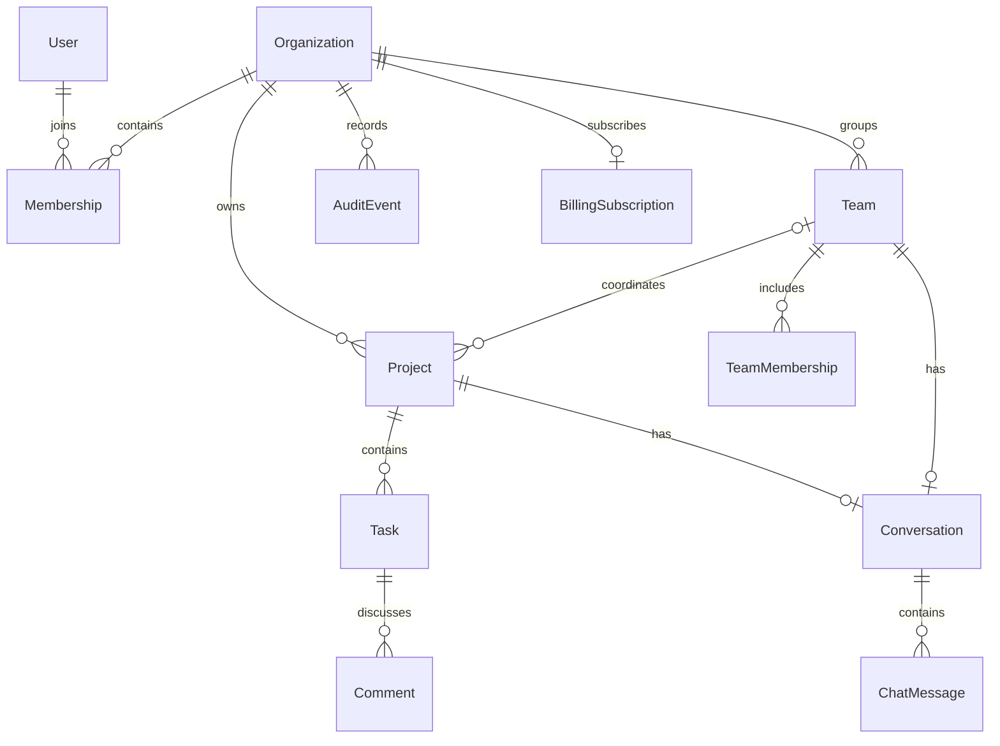
```mermaid
erDiagram
    User ||--o{ Membership : joins
    Organization ||--o{ Membership : contains
    Organization ||--o{ Team : groups
    Organization ||--o{ Project : owns
    Team ||--o{ TeamMembership : includes
    Team o|--o{ Project : coordinates
    Project ||--o{ Task : contains
    Task ||--o{ Comment : discusses
    Project ||--o| Conversation : has
    Team ||--o| Conversation : has
    Conversation ||--o{ ChatMessage : contains
    Organization ||--o{ AuditEvent : records
    Organization ||--o| BillingSubscription : subscribes
```

Key design points:

- Every tenant-owned query includes an organization or project boundary.
- Memberships are unique per `(organizationId, userId)`; team and project joins
  use equivalent composite uniqueness.
- `Project.boardRevision` provides optimistic concurrency control for Kanban
  reordering.
- Task indexes support board ordering, priority filters, assignee lookup, and
  due-date queries.
- Raw session, invitation, verification, and password-reset tokens are never
  stored; only hashes are persisted.
- Audit records are append-only at the database level.
- Billing webhook event IDs are unique, making provider retries idempotent.
- Timestamps use timezone-aware PostgreSQL columns and UUIDs are generated by
  PostgreSQL.

## 6. API Documentation

Detailed contracts: [`docs/api.md`](docs/api.md). Responses use a consistent
`data` / `meta` envelope and normalized application errors.

| Method           | Route                                         | Guard / purpose                                       |
| ---------------- | --------------------------------------------- | ----------------------------------------------------- |
| POST             | `/api/auth/register`, `/login`, `/logout`     | Public registration/login; authenticated logout       |
| POST             | `/api/auth/verify-email`, `/password-reset/*` | Hashed, expiring one-time token workflows             |
| GET/POST         | `/api/organizations`                          | List memberships / create workspace                   |
| PATCH/DELETE     | `/api/organizations/[id]`                     | Authorized workspace administration                   |
| GET/POST         | `/api/teams`, `/api/teams/[id]/members`       | Tenant-scoped team management                         |
| GET/POST         | `/api/projects`                               | Project directory / project creation                  |
| GET/PATCH/DELETE | `/api/projects/[id]`                          | Project read and management                           |
| GET/PATCH        | `/api/projects/[id]/board`                    | Read or atomically reorder Kanban tasks               |
| GET/POST         | `/api/tasks`, `/api/tasks/[id]/comments`      | Task and comment workflows                            |
| GET/PATCH/DELETE | `/api/comments/[id]`                          | Author editing and manager moderation                 |
| GET              | `/api/search`                                 | Organization-scoped project and task search           |
| GET              | `/api/analytics`, `/api/analytics/export`     | Filtered metrics and CSV export                       |
| GET/POST         | `/api/chat/conversations/*`                   | Conversation history, messages, and read state        |
| GET/POST         | `/api/notifications/*`                        | Inbox, preferences, and read state                    |
| GET              | `/api/audit`                                  | Owner/admin tenant audit history                      |
| GET/POST         | `/api/billing/*`                              | Subscription snapshot, checkout, portal, cancellation |
| POST             | `/api/billing/webhooks/[provider]`            | Signed, idempotent subscription events                |
| GET              | `/api/health?check=database`                  | Public liveness; optional database readiness          |

## 7. Authentication Strategy

- Passwords are derived with Node's `scrypt`, a unique 16-byte salt, and a
  constant-time comparison.
- Successful registration and login create opaque session tokens. Only a
  SHA-256 token hash is stored in PostgreSQL.
- Sessions use secure, HTTP-only cookie transport and explicit expiry.
- Email verification and password resets use separate hashed, expiring,
  single-use token types.
- Authentication responses avoid account enumeration.
- WebSocket connections reuse the session cookie, validate the request origin,
  and authorize every requested project or team room.
- Server-side guards are the source of truth; hiding a button never grants or
  revokes permission.

Role capabilities are intentionally asymmetric:

| Role    | Typical capability                                                 |
| ------- | ------------------------------------------------------------------ |
| OWNER   | Full workspace lifecycle, members, projects, billing, and audit    |
| ADMIN   | Workspace/member/project administration without ownership deletion |
| MANAGER | Read members and manage projects/tasks                             |
| MEMBER  | Read workspace/member data and collaborate                         |
| VIEWER  | Read permitted workspace/project surfaces only                     |

## 8. Security Considerations

- **Tenant isolation** — service guards resolve membership before accessing
  organization-owned records.
- **Same-origin mutation checks** — state-changing API requests reject foreign
  origins before service execution.
- **Rate limits** — authentication and mutation limits use Redis when available
  and an in-process fallback for local resilience.
- **Hashed credentials and tokens** — password and bearer-equivalent values are
  never stored in plaintext.
- **Input validation** — strict Zod schemas reject unknown or malformed input at
  route and realtime boundaries.
- **Optimistic concurrency** — stale board revisions fail instead of silently
  overwriting a teammate's changes.
- **Webhook verification** — billing payloads require a configured signature and
  unique provider event ID.
- **Safe activity metadata** — response mapping exposes an action-specific
  allowlist rather than arbitrary stored JSON.
- **Immutable audit history** — database rules reject update and delete attempts
  against audit records.
- **Local-only demo seed** — seeding refuses production mode and non-loopback
  database hosts.

## 9. Testing Strategy

```bash
npm test            # focused unit/service tests
npm run test:db     # disposable PostgreSQL integration suite
npm run test:e2e    # Playwright application workflows
npm run test:api    # production-server API smoke checks
npm run check       # lint + format + schema + types + unit tests + build
```

The test suite covers:

- Authentication, session handling, authorization, request security, and API
  error contracts
- Tenant isolation, foreign keys, SQL checks, cascades, and transaction rollback
- Seed repeatability and preservation of user-edited records
- Kanban ordering, empty-column moves, concurrent revision conflicts, and
  rollback when an activity write fails
- Comment ownership, manager moderation, mentions, and pagination
- Realtime room contracts, chat history, read state, and cross-tenant denial
- Billing entitlements, usage, and idempotent webhook handling
- Responsive browser layouts and complete user-facing workflows

Database tests create a randomly named database, apply the real migrations, run
against it, and remove only that database during cleanup.

## 10. Performance Considerations

- Composite indexes match board, membership, notification, activity, message,
  and audit pagination patterns.
- Cursor pagination avoids increasingly expensive offsets for activity, chat,
  comments, notifications, and audit history.
- Analytics queries run independent aggregates in parallel.
- Unfiltered analytics snapshots are cached in Redis with explicit invalidation;
  PostgreSQL remains the fallback when Redis is unavailable.
- Server Components keep data access on the server and reduce client-side fetch
  waterfalls.
- Realtime events carry small invalidation/change payloads rather than entire
  tenant snapshots.
- Search and filters retain URL state, making results linkable without a global
  client store.

## 11. Deployment Architecture

The repository currently targets self-hosted or container-based deployment; no
cloud vendor is required by the application design.

```text
Browser
  ├── HTTPS → Next.js application (pages + REST API)
  └── WSS   → Socket.IO gateway

Next.js / gateway / worker
  ├── PostgreSQL 17   authoritative application state
  └── Redis 7         cache, rate limits, pub/sub, BullMQ

Email worker
  └── provider adapter / local preview delivery
```

Production requires HTTPS origins, independent secrets, managed PostgreSQL and
Redis backups, a supervised worker and realtime process, and a hosted billing
provider adapter. The built-in local billing provider exists for development and
must not be used to charge customers.

## 12. Screenshots

<details open>
<summary><strong>Getting started</strong></summary>

| Product home                                                | Account registration                                                     |
| ----------------------------------------------------------- | ------------------------------------------------------------------------ |
| 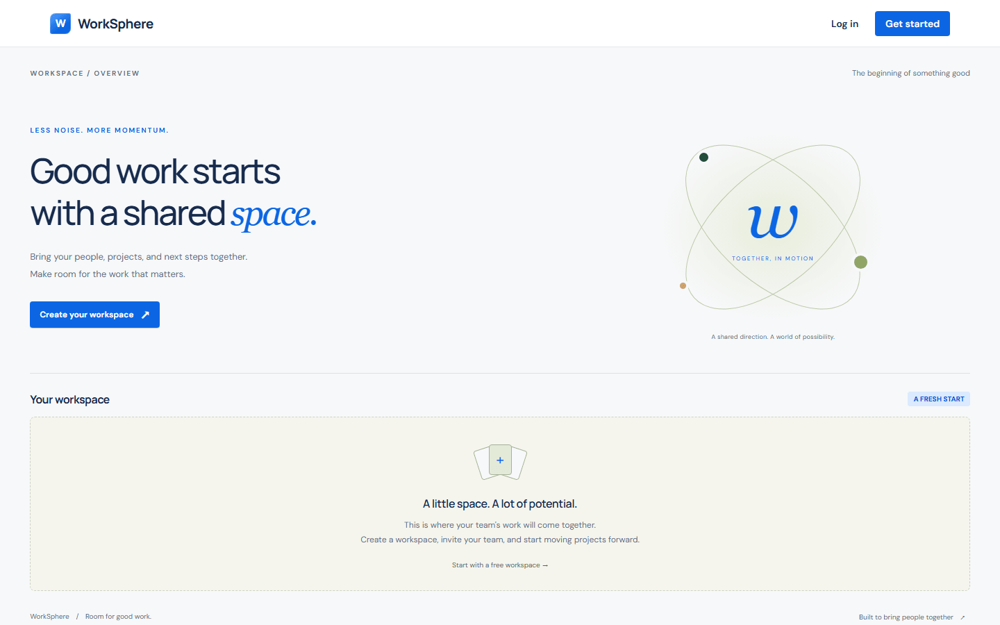 | 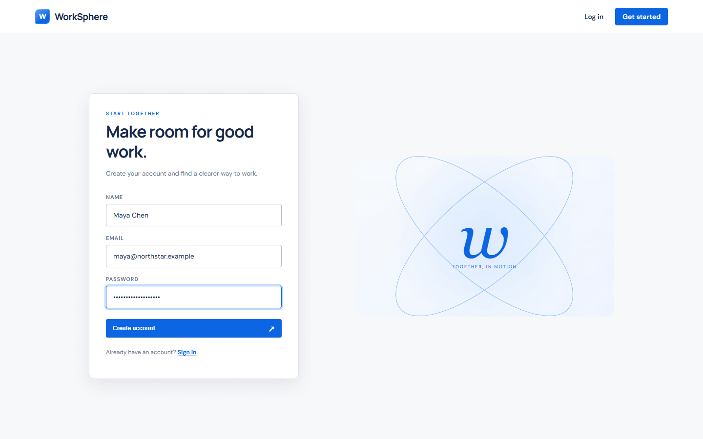 |

| Demo sign-in                                          | Responsive navigation                                                         |
| ----------------------------------------------------- | ----------------------------------------------------------------------------- |
| 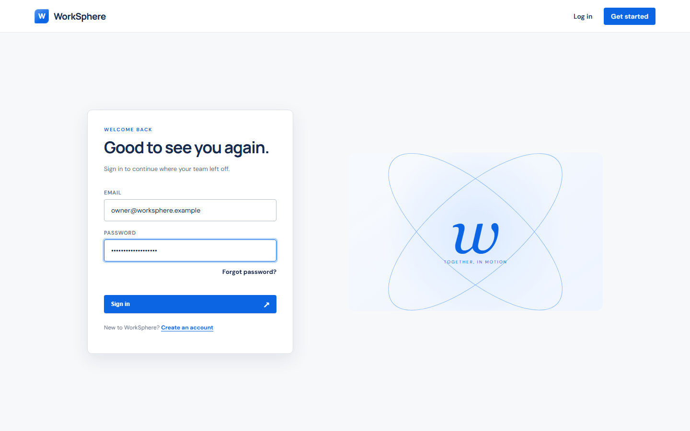 | 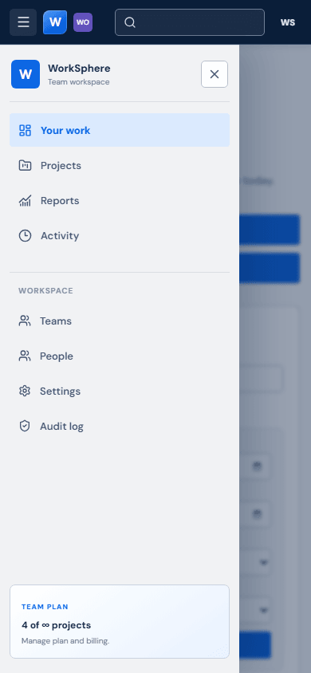 |

</details>

<details>
<summary><strong>Workspace overview</strong></summary>

| Workspace intelligence                                                  | Project directory                                                    |
| ----------------------------------------------------------------------- | -------------------------------------------------------------------- |
|  | 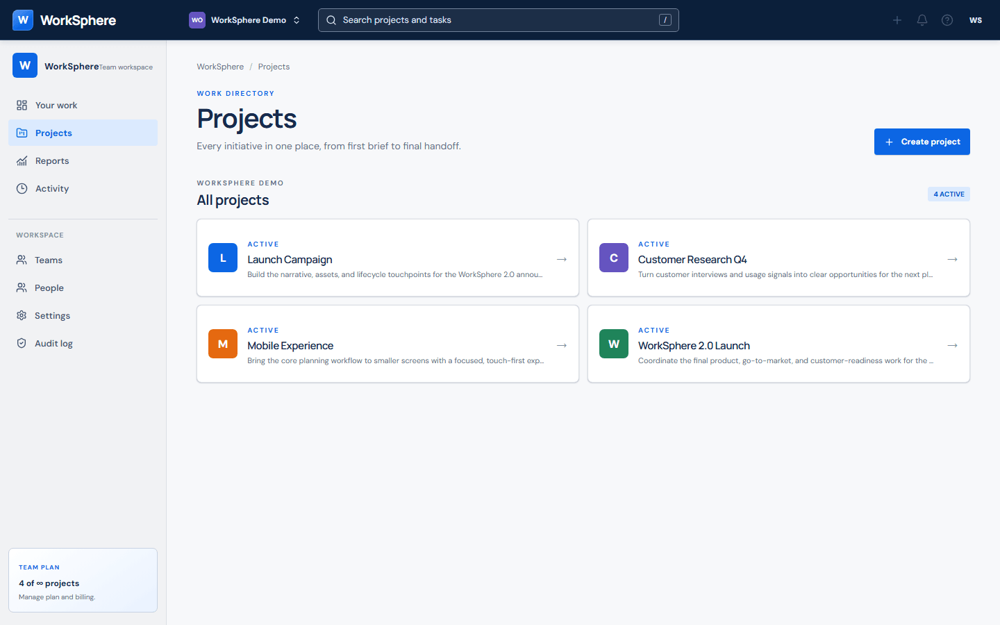 |

| Reporting                                                           | Activity timeline                                                    |
| ------------------------------------------------------------------- | -------------------------------------------------------------------- |
| 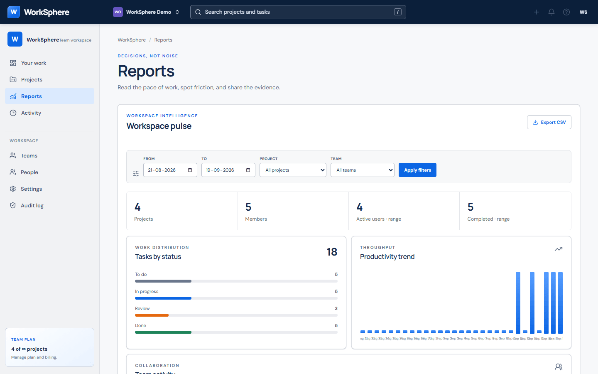 | 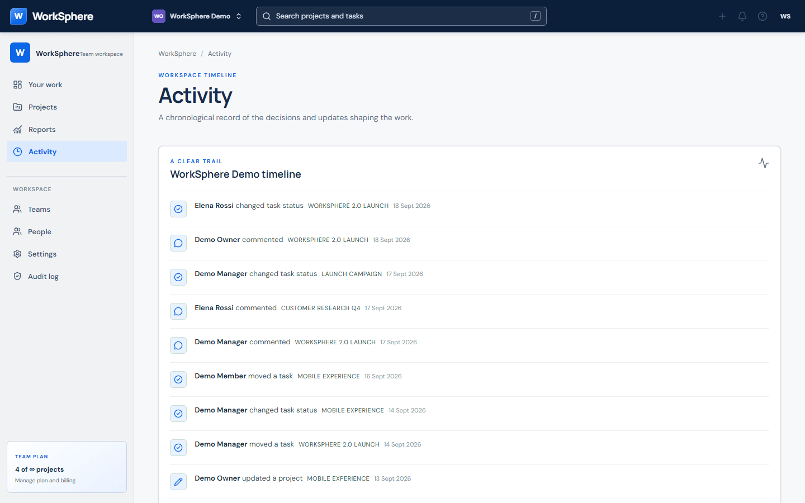 |

</details>

<details>
<summary><strong>Project delivery</strong></summary>

| Kanban board                                                           | Task detail and discussion                                                |
| ---------------------------------------------------------------------- | ------------------------------------------------------------------------- |
|  | 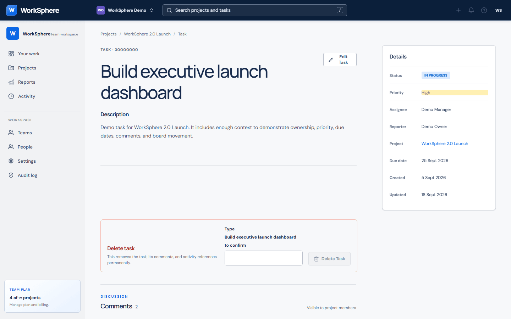 |

| Project activity                                                            | Project chat                                                        |
| --------------------------------------------------------------------------- | ------------------------------------------------------------------- |
| 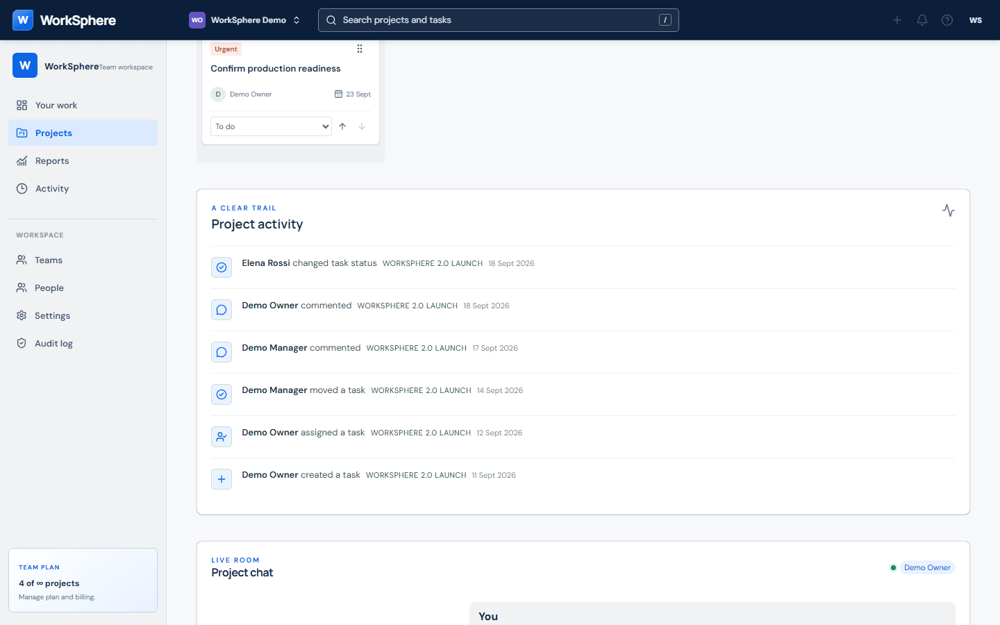 | 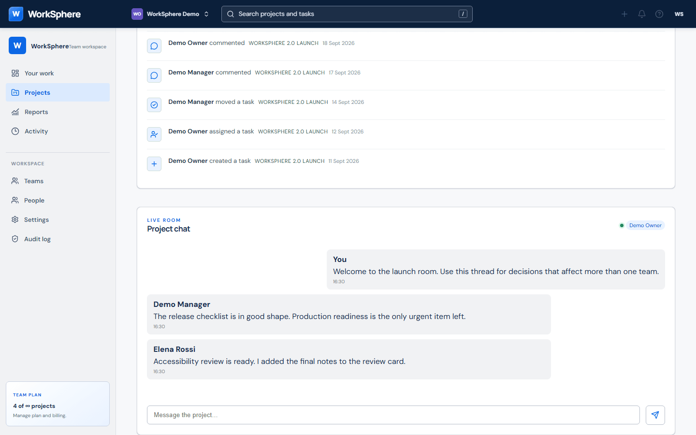 |

</details>

<details>
<summary><strong>People and communication</strong></summary>

| Team directory                                                 | Team room                                                             |
| -------------------------------------------------------------- | --------------------------------------------------------------------- |
| 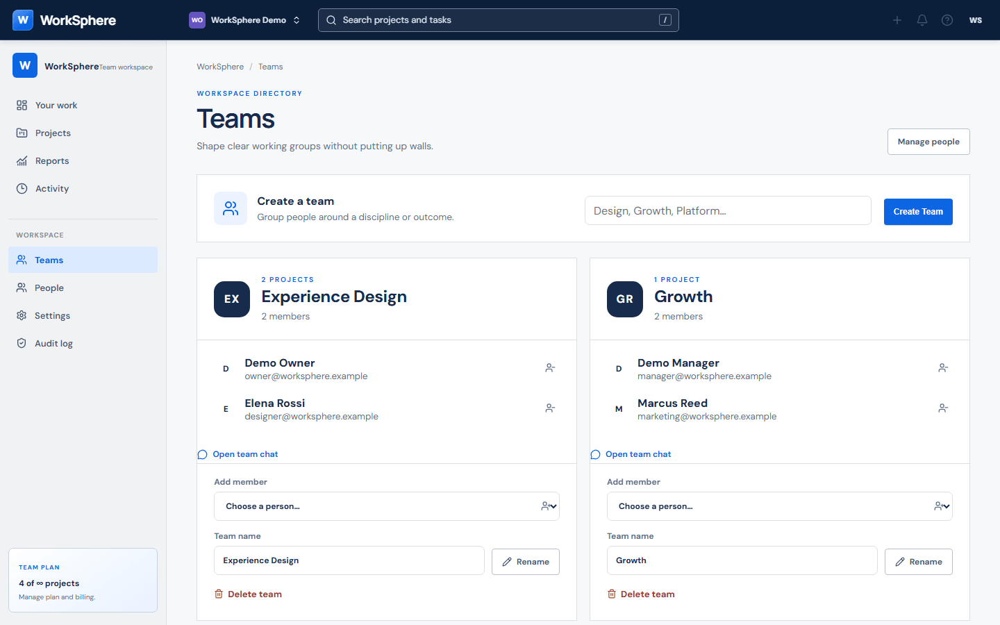 | 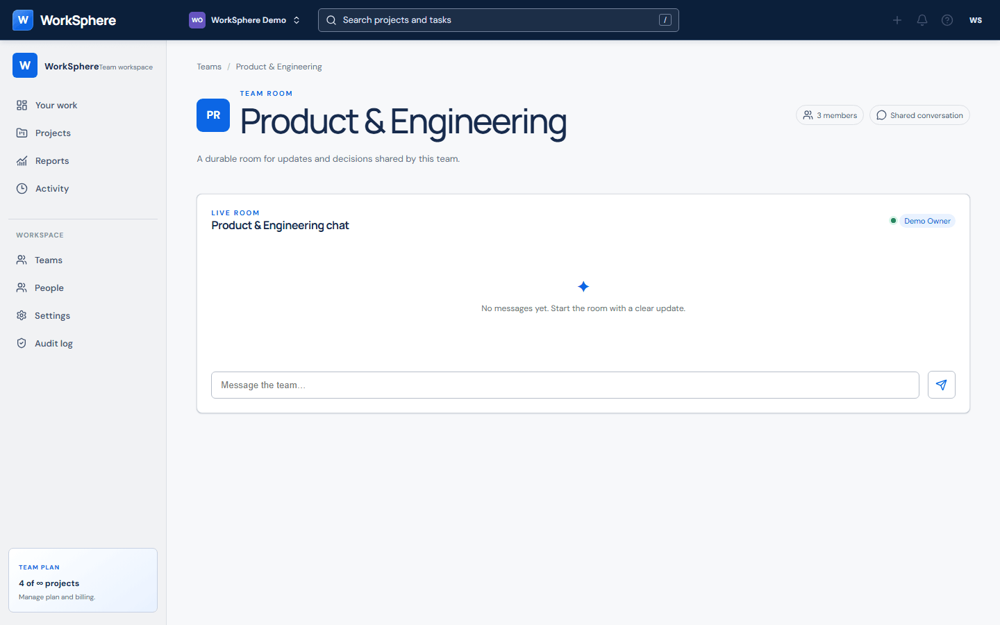 |

| People and invitations                                             | Notification center                                                         |
| ------------------------------------------------------------------ | --------------------------------------------------------------------------- |
|  | 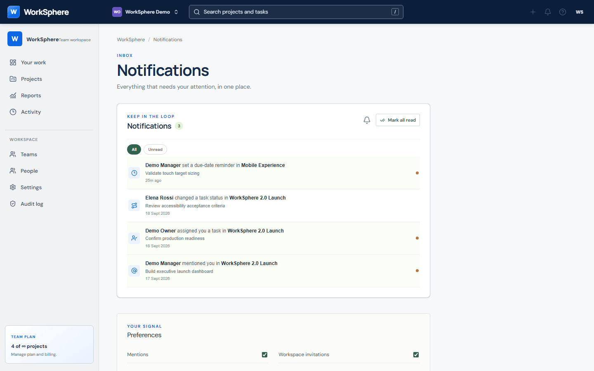 |

</details>

<details>
<summary><strong>Administration</strong></summary>

| Project settings                                                            | Workspace settings                                                              |
| --------------------------------------------------------------------------- | ------------------------------------------------------------------------------- |
| 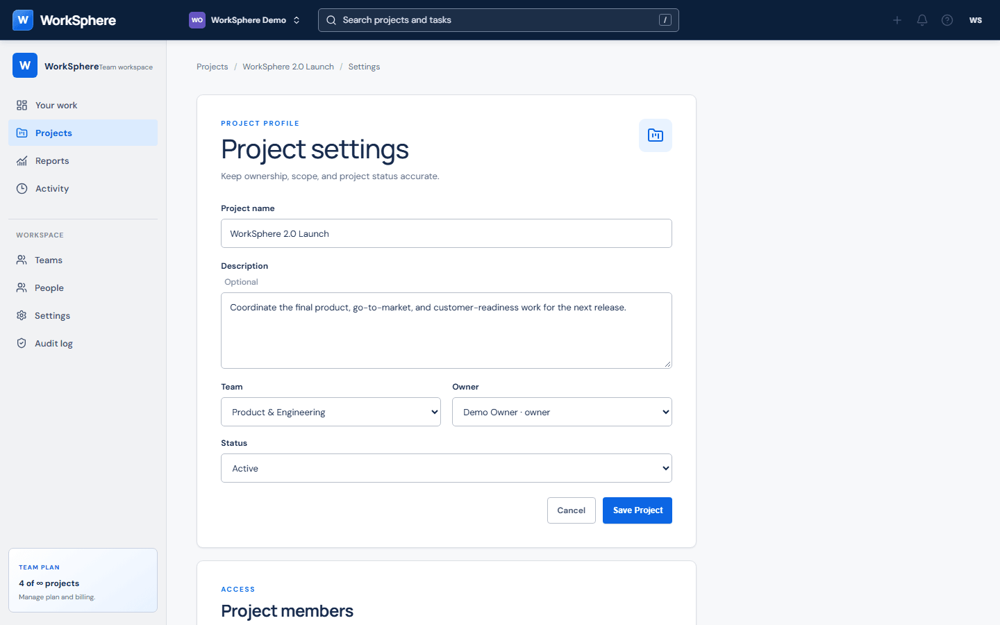 | 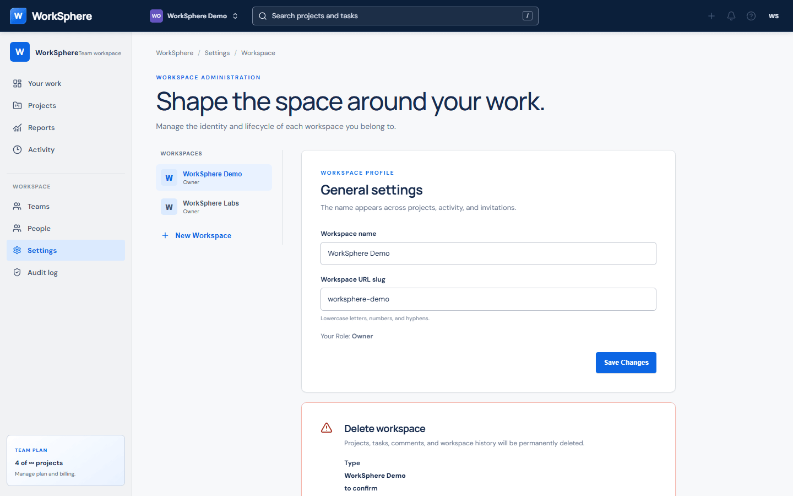 |

| Account settings                                                            | Billing and capacity                                               |
| --------------------------------------------------------------------------- | ------------------------------------------------------------------ |
| 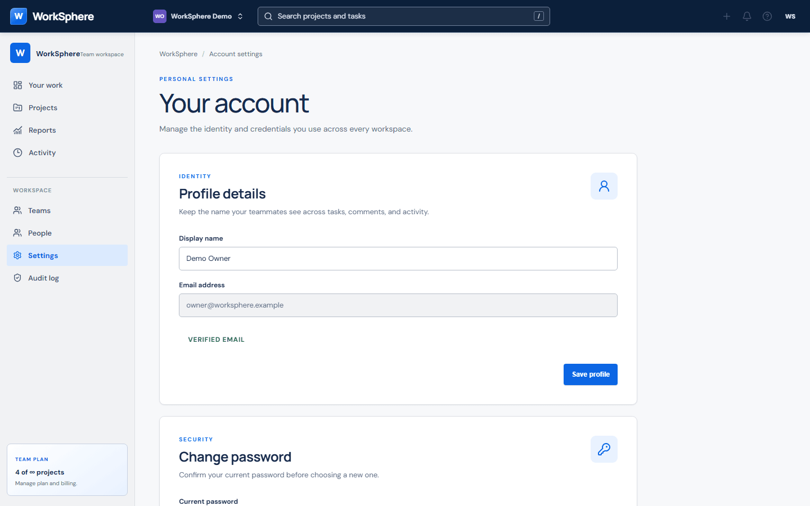 |  |

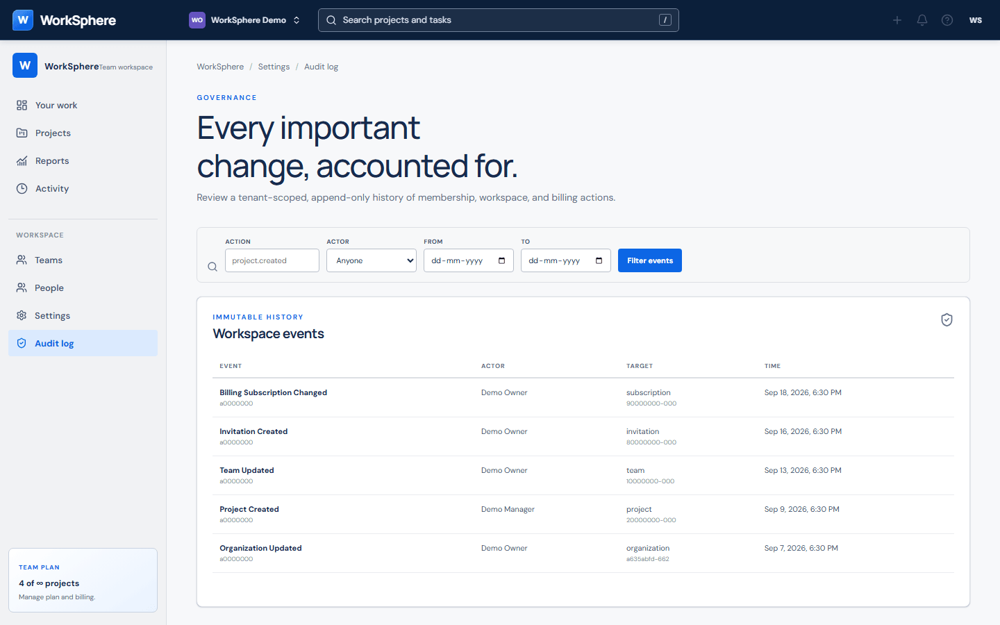

</details>

## 13. Demo


_Full tour: product home → registration → sign-in → workspace dashboard →
projects → Kanban board → task detail → reports → teams → people → billing →
audit history._

The media is generated from the real application with Playwright:

```bash
npm run demo:capture
```

## 14. What I Learned

- **Tenant boundaries belong in services and queries.** A workspace selector is
  presentation; organization-scoped guards are authorization.
- **Optimistic concurrency makes collaborative ordering predictable.** A single
  project revision turns silent board overwrites into recoverable conflicts.
- **Persistence and realtime have different responsibilities.** PostgreSQL
  commits the truth; Socket.IO improves latency but is safe to miss.
- **Activity, notifications, and audit logs are separate products.** Activity
  explains work, notifications request attention, and immutable audit records
  support governance.
- **Fallbacks require explicit semantics.** Optional Redis improves caching and
  coordination without making core reads or authentication unavailable locally.
- **Responsive navigation is functionality.** A sidebar that merely fits on a
  small viewport is not useful unless it can be opened, trapped, dismissed, and
  navigated by keyboard.

## 15. Future Improvements

- Replace the local billing adapter with Stripe or another hosted provider
- Add object storage and malware scanning for chat attachments
- Introduce full-text search with PostgreSQL `tsvector` or a dedicated service
- Add recurring tasks, dependencies, milestones, and timeline views
- Support organization SSO, SCIM provisioning, and enforced MFA
- Add digest emails and configurable notification schedules
- Add OpenTelemetry traces, structured metrics, and production dashboards
- Add automated accessibility scans and visual regression snapshots to CI

## 16. Trade-offs & Design Decisions

| Decision                         | Trade-off                                          | Why                                                                               |
| -------------------------------- | -------------------------------------------------- | --------------------------------------------------------------------------------- |
| Modular monolith                 | Domains share one deployment and database          | Fast iteration with clear service boundaries; extraction can follow real pressure |
| Database sessions                | Session lookup on authenticated requests           | Immediate revocation and no authorization claims frozen inside a JWT              |
| PostgreSQL as realtime authority | Clients may briefly refresh after a missed event   | Delivery failures cannot corrupt or erase durable state                           |
| Project-wide board revision      | Unrelated simultaneous moves can conflict          | Simple, auditable consistency for a portfolio-scale board                         |
| Hand-authored CSS                | More local style maintenance                       | Precise product identity and responsive behavior without framework coupling       |
| Optional Redis                   | Local fallback is per-process and less coordinated | Core workflows remain usable without extra infrastructure                         |
| Append-only audit records        | Corrections require compensating events            | Governance history cannot be silently rewritten                                   |
| Local demo billing provider      | No real payments                                   | Complete plan/usage UI without external accounts or unsafe demo charges           |

## 17. Scaling Strategy

- **Application tier** — run multiple stateless Next.js instances behind a load
  balancer; keep session and application state in PostgreSQL/Redis.
- **Realtime tier** — use the Socket.IO Redis adapter so authorized rooms span
  gateway instances.
- **Read path** — add PostgreSQL read replicas for analytics and timeline reads;
  retain primary reads where read-after-write consistency matters.
- **Background work** — scale BullMQ workers independently and use idempotency
  keys for every externally visible delivery.
- **Search** — publish a tenant-scoped index feed to PostgreSQL full-text,
  Typesense, or OpenSearch.
- **Analytics** — move long-range aggregates into rollup tables or a warehouse
  while keeping operational counts in PostgreSQL.
- **Files** — upload directly to object storage with signed URLs and process
  metadata asynchronously.
- **Tenant growth** — partition high-volume activity, notification, message, and
  audit tables by time or organization when measured query patterns require it.

## Getting Started (Local)

Prerequisites: Docker Desktop, Git, and Node.js 22.14+ within 22.x or Node.js
24.x.

```bash
npm ci
npm run setup
npm run db:setup
npm run dev
```

Open <http://localhost:3000>. To run realtime chat and queued email processing in
separate terminals:

```bash
npm run infra:up
npm run realtime
npm run worker
```

**Local demo account**

- Email: `owner@worksphere.example`
- Password: `WorkSphereDemo!2026`

The repeatable seed creates a populated showcase with five users, three teams,
four projects, eighteen tasks, comments, conversations, notifications, activity,
billing usage, and audit history. It refuses production and non-loopback
databases.

## Environment

Copy `.env.example` through `npm run setup`. Important variables:

| Variable                   | Required        | Purpose                                           |
| -------------------------- | --------------- | ------------------------------------------------- |
| `APP_URL`                  | Yes             | Canonical HTTP(S) origin                          |
| `DATABASE_URL`             | Yes             | PostgreSQL connection URL and schema              |
| `REDIS_URL`                | No              | Cache, rate-limit, pub/sub, and BullMQ connection |
| `REDIS_DISABLED`           | No              | Force PostgreSQL/in-process fallbacks             |
| `NEXT_PUBLIC_REALTIME_URL` | For realtime    | Browser-visible Socket.IO gateway origin          |
| `REALTIME_PORT`            | For realtime    | Gateway listen port                               |
| `EMAIL_DELIVERY_PREVIEW`   | Local/test only | Preview token-based email flows                   |
| `BILLING_WEBHOOK_SECRET`   | Billing         | Webhook signature secret                          |
| `BILLING_PROVIDER`         | No              | `local` for the built-in development adapter      |

## Scripts

| Command                                       | Description                                               |
| --------------------------------------------- | --------------------------------------------------------- |
| `npm run dev` / `build` / `start`             | Next.js lifecycle                                         |
| `npm run lint` / `format:check` / `typecheck` | Static quality gates                                      |
| `npm test` / `test:db` / `test:e2e`           | Unit, disposable database, and browser suites             |
| `npm run test:api` / `test:auth`              | Production API and authentication smoke checks            |
| `npm run db:setup` / `db:deploy` / `db:seed`  | PostgreSQL migration and demo-data workflows              |
| `npm run infra:up` / `infra:stop`             | PostgreSQL and Redis lifecycle                            |
| `npm run realtime` / `worker`                 | Socket.IO gateway and BullMQ email worker                 |
| `npm run demo:capture`                        | Rebuild README screenshots and animated walkthrough       |
| `npm run check`                               | Full lint, format, schema, type, unit, and build pipeline |

Additional implementation notes live in [`docs/`](docs/), including the API,
authentication, database, and day-by-day verification records.
