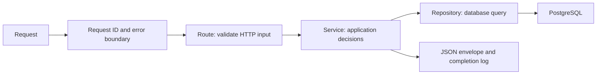

# API foundation

## Request flow



`src/app/api/health/route.ts` is the first concrete controller. It validates query
parameters, calls `health.service.ts`, and returns a success result. The service
uses the repository for the optional database check and translates connection
failures into `SERVICE_UNAVAILABLE`. The repository performs a parameterized
`SELECT 1` through the shared Prisma client; it knows nothing about HTTP.

`createApiHandler` assigns a request ID, catches failures including response
serialization, writes the response envelope, and emits one completion log.
Services and repositories never construct HTTP responses. Future services own
authorization, business rules, and transactions; repositories receive verified
tenant scope and return explicit safe field projections.

## Response contract

JSON success (HTTP 200 by default; 201/202 supported):

```json
{
  "data": {
    "status": "ok",
    "service": "worksphere",
    "timestamp": "2026-09-15T00:00:00.000Z"
  },
  "meta": { "requestId": "9c7abddb-a568-4cc2-8b4e-b7d5cbb63f21" }
}
```

JSON error:

```json
{
  "error": {
    "code": "VALIDATION_ERROR",
    "message": "Request validation failed.",
    "details": [
      { "path": "check", "code": "invalid_value", "message": "Invalid value." }
    ]
  },
  "meta": { "requestId": "9c7abddb-a568-4cc2-8b4e-b7d5cbb63f21" }
}
```

Every handled response includes `X-Request-ID` and `Cache-Control: no-store`.
The request ID in JSON matches the header and completion log. A supplied
`X-Request-ID` is retained only if it has a valid UUID layout (versions 1–8 with
the standard variant); otherwise a new UUID is generated. Accepted IDs are
lowercased. Caller-provided IDs are correlation hints, not authentication,
idempotency keys, or a uniqueness guarantee.

`HEAD` preserves the corresponding status/headers and omits the body. Explicit
204 responses also have no body. JSON routes use `success(data, options)` or
`noContent(headers)` rather than returning raw responses. The JSON wrapper is
not intended for redirects, streaming, downloads, or Next.js navigation helpers;
those need a separate response path when introduced.

### Typed application errors

Throw `new AppError(code)` for expected application failures. An optional
`cause` retains the internal exception in memory, but is never serialized or
logged by the HTTP boundary. Messages and statuses are centrally defined;
callers cannot accidentally expose a database error as a public message.

| Status | Codes                                             |
| ------ | ------------------------------------------------- |
| 400    | `BAD_REQUEST`, `INVALID_JSON`, `VALIDATION_ERROR` |
| 401    | `UNAUTHENTICATED`                                 |
| 403    | `FORBIDDEN`                                       |
| 404    | `NOT_FOUND`                                       |
| 405    | `METHOD_NOT_ALLOWED`                              |
| 409    | `CONFLICT`                                        |
| 413    | `PAYLOAD_TOO_LARGE`                               |
| 415    | `UNSUPPORTED_MEDIA_TYPE`                          |
| 429    | `RATE_LIMITED`                                    |
| 500    | `INTERNAL_ERROR`                                  |
| 503    | `SERVICE_UNAVAILABLE`                             |

Unknown exceptions become an opaque 500 response. Translate known persistence
errors where their meaning is understood by a service; do not globally assume
every unique/FK violation has the same business meaning. Only deliberately
constructed validation issues belong in the public `details` array. Set
protocol headers such as `Allow` or `Retry-After` through error options as needed.
Error codes for authentication and rate limits are conventions, not implemented
authentication or rate limiting.

## Input validation

Helpers in `src/lib/api/validation.ts` support Zod transformations, defaults,
and async refinements:

- `parseInput(schema, value)` validates arbitrary input.
- `parseQuery(request, schema)` parses query fields and rejects repeated keys
  rather than silently choosing a value. For now, query fields are single-valued.
- `parseParams(context.params, schema)` awaits Next.js dynamic parameters and
  validates them before service calls.
- `parseJson(request, schema)` requires `application/json` or an
  `application/*+json` media type, decodes UTF-8 JSON, and validates the result.

Use `z.strictObject` for API inputs to reject unknown fields; strip or passthrough
behavior must be an intentional schema decision. Parsed output, not raw input,
goes to services. Do not trust an organization/user ID merely because it passed
schema validation. Authorization begins with authentication and tenancy work.

JSON bodies are limited to 64 KiB by default. A larger declared Content-Length
is rejected early, and the stream's actual bytes are counted even when the
header is absent or understates the size. Oversized streams are cancelled.
Malformed/empty JSON and invalid UTF-8 return 400; valid JSON with the wrong
shape returns `VALIDATION_ERROR`. An explicit positive byte limit can be supplied
for a route. This is not an upload parser or protection against slow clients;
deployment-level timeouts and upload handling are separate work.

Validation responses contain at most 20 issues and bounded field paths, with
generic messages. Submitted values, unknown-key lists, custom Zod messages,
regexes, and enum contents are not copied into responses or logs.

## Available endpoints

| Request                                | Behavior                                               |
| -------------------------------------- | ------------------------------------------------------ |
| `GET /api/health` or `?check=live`     | Application liveness; never queries PostgreSQL         |
| `GET /api/health?check=database`       | Minimal database connectivity check; 200 or a safe 503 |
| `HEAD /api/health`                     | Same validation/status as GET, without a body          |
| `OPTIONS /api/health`                  | 204 with `Allow: GET, HEAD, OPTIONS`                   |
| POST/PUT/PATCH/DELETE on `/api/health` | JSON 405 with the same Allow header                    |
| Unmatched `/api` paths                 | JSON 404 for supported HTTP methods                    |

An invalid or unknown health query field returns 400. The database probe reports
only availability, never credentials, hostnames, record counts, or tenant data.
It checks connectivity, not migration state, Redis, or full deployment readiness.
The shared pool has a connection timeout; production network/statement timeouts
and infrastructure monitoring remain separate work.

Next.js/proxy failures before the route runs and HTTP methods not supported by
Next.js may use framework responses. The envelope covers the application routes
and methods exported here. Health checks are public; no business-data endpoints
are exposed on Day 3.

**Day 1/2 compatibility:** health fields moved under `data`. Clients should read
`data.status` rather than top-level `status`. Default liveness behavior and
`Cache-Control: no-store` are preserved.

## Request logs

The logger writes one JSON line to stdout for each completed request:

```json
{
  "timestamp": "2026-09-15T00:00:00.000Z",
  "level": "info",
  "event": "http.request.completed",
  "requestId": "9c7abddb-a568-4cc2-8b4e-b7d5cbb63f21",
  "route": "/api/health",
  "method": "GET",
  "status": 200,
  "durationMs": 1.25
}
```

4xx responses log at `warn`; 5xx responses log at `error`, with a safe error code.
The route is a developer-defined template, not the raw URL or dynamic path.
Headers, cookies, query values, payloads, SQL, exception messages, and stacks are
excluded through a field allowlist. Request context is local to each invocation,
so concurrent requests cannot overwrite one another's IDs.

If the log writer fails, the completed response is preserved and a fixed
`http.request.log_failed` fallback is written. Do not log again in each layer
for the same request. Rich diagnostic logging and external log storage can be
added later with explicit redaction; this foundation favors a small safe contract.

## Verification commands

```sh
npm run check
npm run db:up
npm run test:api
```

`check` builds the app and runs environment/API unit tests without a database.
`test:api` requires that build and a running configured PostgreSQL server. It
launches temporary production servers on unused loopback ports, verifies the
real HTTP routes and captured JSON logs, and also tests a server pointed at an
unavailable database. It stops its own servers afterward and never stops or
modifies the development database. JSON body helpers are tested using synthetic
requests; no artificial public mutation endpoint is added just for testing.

Relevant framework behavior: [Next.js Route Handlers](https://nextjs.org/docs/app/api-reference/file-conventions/route).
Schema parsing: [Zod basics](https://zod.dev/basics).
