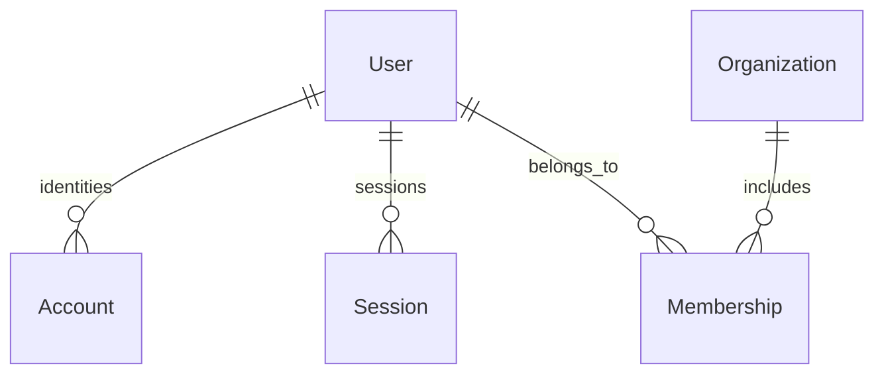

# Database foundation

## Local PostgreSQL

`compose.yaml` runs PostgreSQL 17 on `127.0.0.1:54329`, with database/user
`worksphere` and the local-only password from `.env.example`. It waits for a
PostgreSQL health check and stores data in `worksphere_postgres_data`.

`npm run db:stop` preserves data. `npm run db:up` resumes it. The application
runs on the host, so its URL uses `localhost`, not the Compose service name.
If port 54329 is occupied, change the host port in Compose and `DATABASE_URL`
together. Changing credentials in Compose does not update an initialized
volume; existing database credentials remain in effect.

This is a development database with a role permitted to create shadow/test
databases. Deployment will use separately provisioned credentials and access
controls. Do not reuse these local credentials for deployment.

## Model map



| Model          | Purpose and constraints                                                                                             |
| -------------- | ------------------------------------------------------------------------------------------------------------------- |
| `User`         | UUID identity; unique, trimmed lowercase email; nonempty display name; optional verification time and password hash |
| `Account`      | External identity associated with a user; unique provider/account ID pair                                           |
| `Session`      | User session record; unique 64-character lowercase hexadecimal token hash; expiry after creation                    |
| `Organization` | UUID workspace identity; unique lowercase URL slug and nonempty name                                                |
| `Membership`   | User/organization join; unique `(organizationId, userId)`; role defaults to `MEMBER`                                |

Roles are `OWNER`, `ADMIN`, `MANAGER`, `MEMBER`, and `VIEWER`. The enum stores
future authorization data; it does not implement authorization. A user can
belong to many organizations, with a different role in each. There is no global
role on `User` and no redundant `ownerId` on `Organization`.

IDs are generated by PostgreSQL using `gen_random_uuid()`. All timestamps use
`timestamptz(3)`; `updatedAt` is maintained by Prisma on updates. Direct SQL
updates must explicitly maintain it. Foreign keys prevent orphan records.
Deleting a user removes their accounts, sessions, and memberships; deleting an
organization removes its memberships, but preserves users. Organization deletion
and last-owner protections must be added before exposing those actions.

Indexes support unique lookups, per-user sessions/accounts/memberships, and
session-expiry cleanup. The composite membership index also supports
organization-scoped membership lookups.

Email normalization is enforced with a SQL CHECK plus a unique index, preventing
case variants from bypassing uniqueness. Application input validation will
normalize email before writes. Additional SQL checks protect slugs, nonempty
names/provider identifiers, token-hash shape, and session timestamp ordering.
These checks live in migration SQL because Prisma does not model them.

Account provider token storage, session generation/rotation, password hashing,
and the authentication library choice belong to the authentication milestone.
`passwordHash` is nullable for provider-only users. Store a hash of a high-entropy
session token; never put raw session tokens in `tokenHash`. No credentials are
created by the seed. No data routes are exposed in Day 2.

## Client lifecycle and module convention

- `src/database/client.ts` is the server-only application singleton. It keeps
  one Prisma/pg pool across Next.js development reloads in each process.
- `src/database/create-client.ts` creates separately owned clients for scripts
  and tests. A client has at most five pool connections, a five-second connection
  timeout, and a thirty-second idle timeout. It connects on the first query.
- Scripts disconnect their clients in `finally`. Request code must not
  disconnect the shared singleton after each request.
- CLI scripts load environment files through `src/config/load-env.ts`. Prisma
  config and application config validate `DATABASE_URL` without echoing it.
- Connection URLs may select a PostgreSQL `schema`; both Prisma migrations and
  the pg adapter honor it. This is a database namespace, not tenant isolation.
- Database modules import `server-only`; CLI scripts use Node's `react-server`
  condition so they can execute those modules outside Next.js.

Use this folder convention when adding actual domain features:

```text
src/modules/<domain>/
  <domain>.service.ts       authorization, business rules, transactions
  <domain>.repository.ts    Prisma queries with explicit scope and projections
  <domain>.schema.ts        input schemas introduced with API validation
```

Routes call services. Services obtain the authenticated context and own
transaction boundaries. Repositories receive a Prisma client or transaction
client explicitly and contain persistence queries, not HTTP handling.

```ts
import type { Prisma } from "@/generated/prisma/client";

// Example contract for a future repository, not a public API.
type DatabaseExecutor = Prisma.TransactionClient;

// A PrismaClient is structurally compatible with DatabaseExecutor.
// Inside database.$transaction(async (tx) => ...), pass tx to every
// repository involved so all writes succeed or roll back together.
```

Every future organization-owned repository method must accept `organizationId`
and include it in its query. Services verify membership using the authenticated
user; a client-supplied organization ID is not authorization. Return explicit
safe field selections and keep password/token hashes out of response objects.
Do not add a generic unscoped CRUD repository or public diagnostic data endpoint.
API responses and application-error conventions begin on Day 3.

## Migration workflow

Fresh environment: `npm run db:setup` applies versioned SQL migrations and seeds
without manual SQL. Application startup never migrates automatically.

For future model changes:

1. Edit `prisma/schema.prisma`.
2. Run `npm run db:migrate -- --name <descriptive_change>` in development.
3. Review the generated SQL and retain any intentional custom CHECK constraints.
   For custom SQL, create with `--create-only`, edit the unapplied migration,
   then apply it with `npm run db:deploy`.
4. Run `npm run db:generate`, `npm run test:db`, and `npm run check`.
5. Commit the schema, migration directory, and migration lock file together.

Never edit an already applied/shared migration, use `db push` as migration
history, or reset a shared database. `db:deploy` applies committed migrations;
it does not create new migrations, generate the client, or seed. The initial
migration wraps DDL in a transaction. Production migration automation is later.

Prisma 7 stores the connection URL in `prisma.config.ts` and requires explicit
seeding. See [Prisma seeding](https://www.prisma.io/docs/orm/v7/prisma-migrate/workflows/seeding)
and [config reference](https://www.prisma.io/docs/orm/v7/reference/prisma-config-reference).

## Repeatable seed and integration tests

`npm run db:seed` uses transactional upserts and stable seed-owned IDs to build
the populated Northstar Collective showcase workspace (`worksphere-demo`). It
includes five people, three teams, four projects, Kanban tasks in every state,
comments, recent activity, notifications, chat, a pending invitation, billing
usage, and audit history. Repeating it refreshes time-sensitive showcase data
without duplicating records. The owner demo login is documented in the root
README. Seeding refuses production mode and non-loopback database hosts.

`npm run test:db` connects to the local server, creates a randomly named
`worksphere_test_<uuid>` database, applies the real committed migrations, runs
the seed CLI twice, and checks uniqueness, foreign keys, SQL checks, cascade
cleanup, and transaction rollback. It also checks that seeding preserves edits.
It removes only the database created by that test run in its cleanup hook.
The application database is never reset. The test role needs CREATEDB; the
development Compose role has it. If the process is forcibly terminated, an
orphan test database may remain for explicit manual cleanup.
